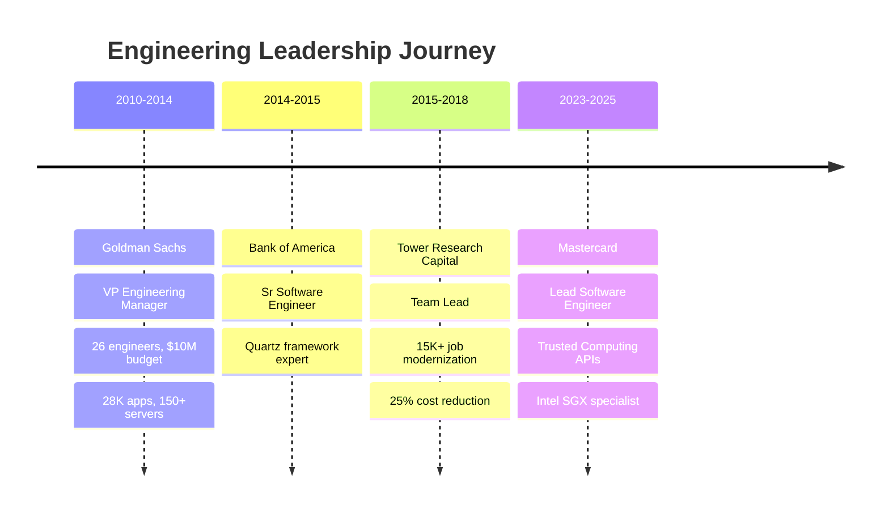

# 🦀 Dwight Browne

<div align="center">
  
  [](https://git.io/typing-svg)
  
  [](https://www.dwightjbrowne.com/)
  [](https://www.linkedin.com/in/dwightbrowne/)
  [](mailto:dwight@dwightjbrowne.com)
  [](https://github.com/dbrowne)
  
</div>

## 👋 About Me

```rust
struct SeniorEngineer {
    name: &'static str,
    location: &'static str,
    role: &'static str,
    expertise: Vec<&'static str>,
    current_focus: Vec<&'static str>,
}

impl SeniorEngineer {
    fn new() -> Self {
        SeniorEngineer {
            name: "Dwight Browne",
            location: "San Francisco, CA",
            role: "Lead Software Engineer | Systems Architect",
            expertise: vec![
                "Trusted Computing (Intel SGX, TEE)",
                "Low-Latency Trading Systems",
                "Enterprise Infrastructure (28K+ apps)",
                "Team Leadership (26+ engineers)",
                "Legacy System Modernization",
            ],
            current_focus: vec![
                "Cryptographic Security APIs in Rust",
                "High-Performance Financial Data Processing",
                "Secure Enclave Design",
                "QUIC Protocol Optimization",
            ],
        }
    }
    
    fn introduce(&self) {
        println!("🚀 Transforming complex systems with {} years of experience", 
                 self.years_of_excellence());
        println!("📊 From Goldman Sachs to Mastercard - building what matters");
    }
    
    fn years_of_excellence(&self) -> i32 { 15 }
}
```

## 🏆 Professional Highlights

<div align="center">

| 🎯 Achievement | 📊 Impact |
|----------------|-----------|
| **Enterprise Scale** | Managed 28,000+ applications & 150+ servers at Goldman Sachs |
| **Team Leadership** | Led global teams of 26+ engineers across EMEA, APAC, and Americas |
| **Cost Optimization** | Reduced vendor costs by 25% while improving system reliability |
| **System Performance** | Cut enterprise downtime by 30% through custom analytics tools |
| **Trading Systems** | Built high-performance NYSE data parsing engine in Rust |
| **Security Architecture** | Designed Rust-based trusted computing APIs for Intel SGX at Mastercard |

</div>

## 🛠️ Technical Arsenal

<div align="center">

### Core Languages


### Infrastructure & DevOps


### Databases & Data


### Specialized Technologies


</div>

## 🚀 Featured Projects & Contributions

<div align="center">

| Project | Description | Tech Stack | Impact |
|---------|-------------|------------|---------|
| **🔐 Trusted Computing API** | Secure execution framework for Intel SGX enclaves at Mastercard |   | Production Security |
| **📈 Trading Insights Engine** | High-performance NYSE data parser with patented algorithms |   | Low-Latency Trading |
| **🏦 [AlphaVantage Client](https://github.com/dbrowne/AlphaVantage)** | Async Rust client for financial market data APIs |  | 🟢 Active |
| **⚡ Batch Processing Overhaul** | Modernized 15,000+ job execution system at Tower Research |   | 2x Reliability |
| **🔧 Enterprise Analytics Tool** | Python-based system analyzing 28K applications at Goldman Sachs |  | 30% Less Downtime |
| **🧬 [Kubernetes CNI](https://github.com/dbrowne)** | Network signature identification for container orchestration |   | Research |

</div>

## 📚 Academic & Research Contributions

- 🎓 **PhD (ABD) & MS in Computer Science** - University of Colorado Boulder
- 📝 Published research on VM-based side-channel attack mitigation
- 🏅 David T. Spaulding Graduate Teaching Fellowship recipient
- 🔬 QUIC protocol benchmarking on ARM Cortex devices
- 🤖 Ported Cirrus ML library to academic bare-metal clusters
- 👨‍🏫 Developed technical curricula for software engineering courses

## 💼 Industry Experience Timeline



## 📊 GitHub Statistics

<div align="center">
  
  
</div>

<div align="center">
  
</div>

## 🎯 Current Initiatives

- 🔐 **Advancing Trusted Computing**: Building next-gen cryptographic security APIs
- 📊 **Financial Data Systems**: Developing low-latency trading analysis tools
- 🦀 **Rust Ecosystem**: Contributing to performance-critical open source projects
- 🎓 **Knowledge Sharing**: Mentoring engineers in secure systems design
- ⚡ **Performance Research**: Benchmarking network protocols and ML frameworks

## 💡 Engineering Philosophy

> *"Excellence in engineering means building systems that are not just functional, but transformational. From managing 28,000 applications to designing secure enclaves, every line of code should contribute to reliability, performance, and innovation."*

### Core Principles
- **🏗️ Scale with Purpose**: Whether it's 26 engineers or 28K applications, architecture for growth
- **⚡ Performance First**: Microseconds matter in trading, milliseconds matter everywhere else
- **🔒 Security by Design**: From Intel SGX to PKCS11, build trust into every layer
- **📈 Measurable Impact**: 30% downtime reduction, 25% cost savings - numbers tell the story
- **👥 Lead by Example**: Mentor, code, architect - stay hands-on while scaling teams

## 🏆 Achievements & Recognition

<div align="center">


</div>

## 📬 Let's Connect

<div align="center">

I'm passionate about solving complex engineering challenges, building high-performance systems, and leading transformational projects. Whether you're interested in Rust development, trusted computing, financial technology, or engineering leadership, I'd love to connect!

[](mailto:dwight@dwightjbrowne.com)
[](https://www.linkedin.com/in/dwightbrowne/)
[](https://www.dwightjbrowne.com/)
[_406--7746-25D366?style=for-the-badge&logo=whatsapp&logoColor=white)](tel:+19174067746)

</div>

---

<div align="center">
  
  **🚀 Transforming Ideas into Scalable Solutions Since ... a while**
  
  
  
  
  
</div>
